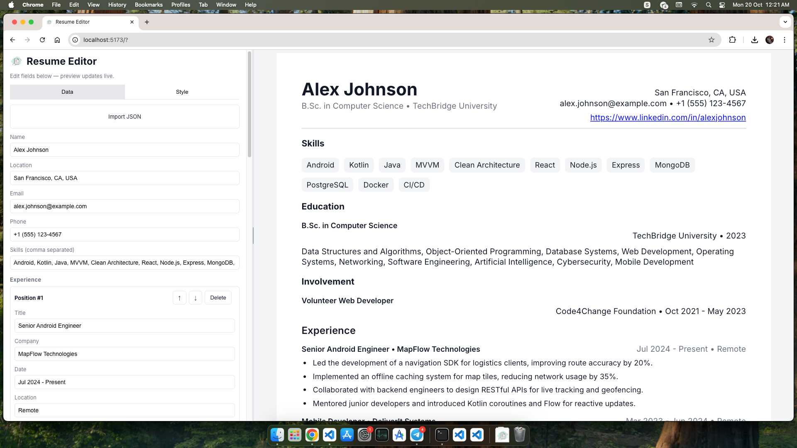

# Resume Editor

A web-based resume editor built with React and Vite. This application allows you to easily create and customize your resume with a live preview.

## Features

*   **Live Preview:** See your changes instantly as you edit your resume.
*   **Customizable Styles:** Adjust margins, font families, font sizes, line heights, letter spacing, and colors for titles and body text.
*   **Font Upload:** Upload custom font files to personalize your resume even further.
*   **Drag-and-Drop Reordering:** Easily reorder your experience entries using drag-and-drop.
*   **JSON Import/Export:** Import your resume data from a JSON file or export it for backup and sharing.
*   **PDF Export:** Download your resume as a PDF document.
*   **Zoom and Pan:** Zoom in/out and pan the preview for a detailed view.

## Getting Started

### Installation

1.  Clone the repository:
    ```bash
    git clone <repository-url>
    cd resume-editor
    ```
2.  Install dependencies:
    ```bash
    npm install
    ```

### Running the Application

```bash
npm run dev
```
The application will be accessible at `http://localhost:5173/` (or another port if 5173 is in use).

## Usage

*   **Data Tab:** Enter your personal information, skills, and experience. You can also import your resume data from a JSON file.
*   **Style Tab:** Customize the appearance of your resume, including margins, fonts, colors, and spacing.
*   **Live Preview:** The right panel displays a live preview of your resume.
*   **PDF Export:** Click "Print / Download PDF" to save your resume as a PDF.

## Preview



## Contributing

Feel free to contribute to this project by opening issues or submitting pull requests.

## License

This project is licensed under the MIT License.